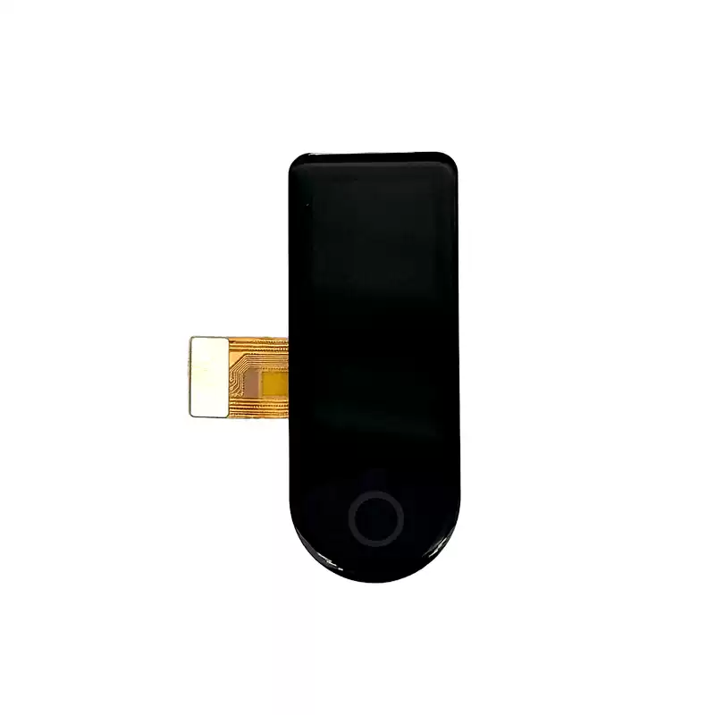

<p align="left"></p>

<h1 align="center">OSPTEK 1.1″ AMOLED 126×294 (ICNA3306 · SPI)</h1>

<p align="center"><b>Bar AMOLED · SPI · ICNA3306</b></p>

<p align="center">English | <a href="./README.md">简体中文</a></p>

<p align="center">
  
  
  
  
</p>

<p align="center"></p>

## Contents

- [Overview](#overview)
- [Specifications](#specifications)
- [Repository layout](#repository-layout)
- [Resources](#resources)
- [Where to Buy](#where-to-buy)
- [Support](#support)

---

## Overview

OSPTEK **1.1″ 126×294 AMOLED** is a **SPI** color display module driven by **ICNA3306**. The tall aspect ratio suits bar HMIs, side status strips, and compact info panels.

Repo id: `1.1-amoled-126x294-spi-icna3306`

Current module version: **AM110Q126294LK1**. Electrical and mechanical details follow [`docs/AM110Q126294LK1.pdf`](./docs/AM110Q126294LK1.pdf).

## Specifications

| Item | Spec |
| ---- | ---- |
| Size | 1.1 inch |
| Type | AMOLED (color) |
| Resolution | 126×294 |
| Interface | SPI |
| Driver IC | ICNA3306 |

> Full outline, FPC definition, power, and timing follow the product datasheet / driver IC datasheet.

## Repository layout

```text
1.1-amoled-126x294-spi-icna3306/
├── README.md
├── README_EN.md
├── LICENSE
├── images/          # README images
├── docs/            # datasheets, init files
└── examples/        # sample projects
```

## Resources

| Resource | Link |
| -------- | ---- |
| Product datasheet (AM110Q126294LK1) | [`docs/AM110Q126294LK1.pdf`](./docs/AM110Q126294LK1.pdf) |

## Where to Buy

<p align="center">
  <a href="https://www.aliexpress.com/store/1105701619"></a>
  &nbsp;&nbsp;
  <a href="https://shop110742373.taobao.com/"></a>
</p>

**International (AliExpress)**

- Store: [OSPTEK Official Store](https://www.aliexpress.com/store/1105701619)

**China (Taobao)**

- Store: [鱼鹰光电工厂店](https://shop110742373.taobao.com/)

## Support

- Technical Support / Sales: <luyu@osptek.com>
- QQ Technical Group: **985881096**
- Website: <https://osptek.com/>
- Feel free to open an Issue in this repository if you have any questions

---

<p align="center"><sub>© 2026 OSPTEK · Licensed under CC BY 4.0</sub></p>
